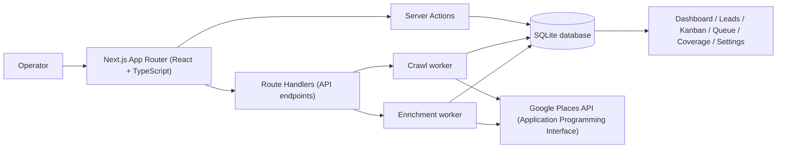
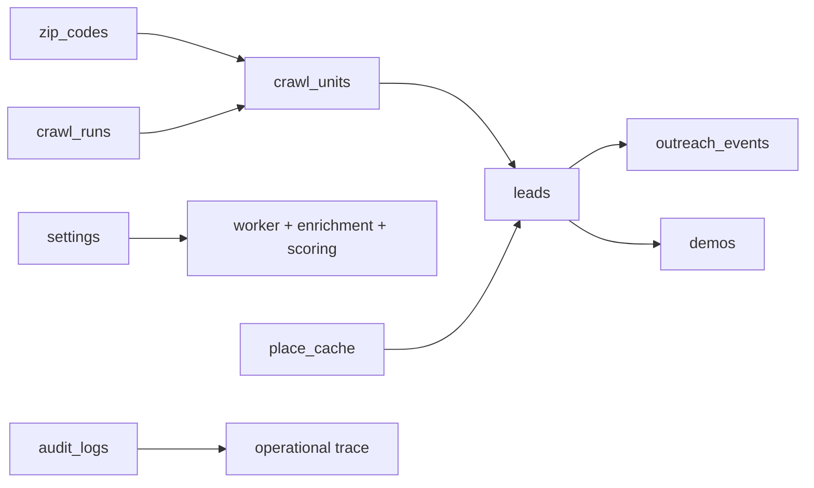
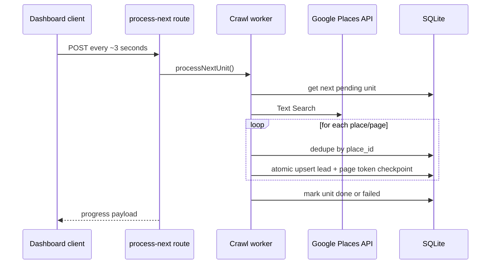

# NoSite Leads: Ultra System Atlas

Use this as the shortest complete map of the product.

## 1) One-screen architecture

## 2) Route map (what each screen does)

| Route | File | Purpose | Primary data path |
|---|---|---|---|
| `/login` | `src/app/login/page.tsx` | Invite-only sign in | `loginAction()` -> cookie session |
| `/dashboard` | `src/app/(protected)/dashboard/page.tsx` | Crawl controls + launch checklist + run stats + cost + conversion | `getDashboardStatsAction()` + polling |
| `/coverage` | `src/app/(protected)/coverage/page.tsx` | Zip progress and failures | coverage queries from `queries.ts` |
| `/explore` | `src/app/(protected)/explore/page.tsx` | Map/list exploration of discovered leads | lead and map queries |
| `/leads` | `src/app/(protected)/leads/page.tsx` | Table + Kanban (board) + filters + bulk status | `getLeads()` or `getKanbanLeads()` |
| `/leads/[id]` | `src/app/(protected)/leads/[id]/page.tsx` | Full lead profile + outreach + verification + demo lifecycle | lead queries + lead actions |
| `/quality` | `src/app/(protected)/quality/page.tsx` | Quality review workspace | quality queries and actions |
| `/queue` | `src/app/(protected)/queue/page.tsx` | Top actionable leads | `getNowQueue(25)` |
| `/scheduler` | `src/app/(protected)/scheduler/page.tsx` | Worker health and controls | scheduler queries/actions |
| `/statistics` | `src/app/(protected)/statistics/page.tsx` | Conversion, cost, and value proof reporting | `getStatisticsSummary()` |
| `/team` | `src/app/(protected)/team/page.tsx` | Team assignment and accountability | team queries |
| `/users` | `src/app/(protected)/users/page.tsx` | Admin-created users and market access | user actions and access queries |
| `/settings` | `src/app/(protected)/settings/page.tsx` | Niche weights, host lists, limits | settings actions |
| `/demo/[slug]` | `src/app/demo/[slug]/page.tsx` | Public published demo | `getPublishedDemoBySlug()` + best-effort view recording |
| `/privacy`, `/terms`, `/support`, `/data-sources` | `src/app/*/page.tsx` | Public invite-only trust pages | static metadata and copy |

## 3) Endpoints (Route Handlers, Application Programming Interface)

| Endpoint | File | Role |
|---|---|---|
| `POST /api/crawl/process-next` | `src/app/api/crawl/process-next/route.ts` | Process one crawl unit |
| `POST /api/crawl/enrich-next` | `src/app/api/crawl/enrich-next/route.ts` | Enrich one lead |
| `POST /api/ai/verify-next` | `src/app/api/ai/verify-next/route.ts` | Process one AI verification job |
| `POST /api/ai/artifacts/process-next` | `src/app/api/ai/artifacts/process-next/route.ts` | Process one AI artifact job |
| `POST /api/scores/recompute-stale` | `src/app/api/scores/recompute-stale/route.ts` | Recompute stale lead scores |
| `GET /api/export/csv` | `src/app/api/export/csv/route.ts` | Filter-aware Comma-Separated Values (CSV) export |
| `GET /api/health` | `src/app/api/health/route.ts` | Coarse public health probe |

## 4) Core engine modules

| Area | File | What it owns |
|---|---|---|
| Authentication | `src/lib/auth.ts` | Static username/password + cookie session |
| Database bootstrap | `src/lib/db/index.ts` | SQLite connection + schema apply |
| Database schema | `src/lib/db/schema.ts` | Tables, constraints, indexes, migrations |
| Data access | `src/lib/db/queries.ts` | Typed queries and writes |
| Crawl loop | `src/lib/crawl/worker.ts` | Unit pick, Places fetch, dedupe, scoring, persistence |
| Crawl actions | `src/lib/crawl/actions.ts` | Start, pause, resume, retry, dashboard stats |
| Enrichment loop | `src/lib/crawl/enrichment.ts` | Place Details, review intelligence, health checks |
| Places client | `src/lib/google-places.ts` | Retry, rate limit, field masks |
| Website classifier | `src/lib/classify-website.ts` | none/social/basic/custom |
| Scoring | `src/lib/scoring.ts` | Factorized score + breakdown |
| Outreach generator | `src/lib/outreach-package.ts` | Template message package |
| Review intelligence | `src/lib/review-intelligence.ts` | Keywords and digital pain signals |
| Website health | `src/lib/website-health.ts` | Status, ssl, speed, redirects |

## 5) Data model in one diagram

## 6) Crawl and enrichment behavior

Enrichment loop is the same pattern with `POST /api/crawl/enrich-next`, one leased lead per scheduler call. The lease recovers stale `running` work, respects `retry_wait`, and terminalizes repeated failures.

## 7) Scoring and ranking (exact mental model)

- Base:
  - `base = log(1 + reviews) * rating`
  - Fallback: if reviews are zero and business is operational, base becomes `2.0`
- Multipliers:
  - niche weight
  - website multiplier (`none`, `social`, `basic`, `custom`)
- Additive bonuses:
  - photo opportunity
  - opening hours
  - opportunity signal
  - website health
  - competitive density
- Qualified lead threshold:
  - `score >= 5.0`

Queue ranking:
- urgent reminder first
- then `0.6 * score + 0.2 * contactability + 0.2 * freshness`

## 8) Lead lifecycle (Customer Relationship Management, CRM)

```mermaid
stateDiagram-v2
  [*] --> new
  new --> verified
  verified --> contacted
  contacted --> preview_sent
  preview_sent --> meeting_set
  meeting_set --> closed_won
  meeting_set --> closed_lost
  contacted --> closed_lost
  verified --> closed_lost
```

Also tracked per lead:
- reminder date
- outreach timeline
- first contacted, first reply, meeting booked
- verification checklist (5 booleans)

## 9) Performance controls already in code

- Kanban capped at 100 rows per load (`src/app/(protected)/leads/page.tsx`)
- Kanban column virtualization for large columns (`src/app/(protected)/leads/kanban-client.tsx`)
- Queue candidate pre-filter before ranking (`getNowQueue()` in `queries.ts`)
- Query indexes for queue and numeric filters (`schema.ts`)
- Route revalidation after lead mutations to keep queue and dashboard fresh (`src/lib/leads/actions.ts`)

## 10) Auth, config, and runtime facts

- Login model: Supabase Auth email/password sessions in `src/lib/auth.ts`
  - `NEXT_PUBLIC_SUPABASE_URL`
  - `NEXT_PUBLIC_SUPABASE_PUBLISHABLE_KEY`
  - `SUPABASE_SERVICE_ROLE_KEY`
  - `NOSITE_BOOTSTRAP_ADMIN_EMAIL`
- Required API/config variables:
  - `DATABASE_URL`
  - `GOOGLE_PLACES_API_KEY`
  - `OPENAI_API_KEY`
  - `NOSITE_ENCRYPTION_SECRET`
  - `WORKER_CRON_SECRET`
- Scheduler:
  - Supabase Cron job `nosite-ai-verification-worker` calls `/api/ai/verify-next` once per minute
  - Supabase Vault secrets: `worker_cron_secret`, `worker_base_url`
- Authorization:
  - App roles live in `app_users`: `admin` and `researcher`
  - Researchers cannot crawl, export, edit settings, or manage users
- Storage:
  - Supabase Postgres in production; SQLite fallback remains for local DB tests
- Public posture:
  - Invite-only app access, public trust pages, and public demo links only when demos are published and not revoked

## 11) Test and operation quick commands

| Command | Use |
|---|---|
| `npm install` | install dependencies |
| `npm run dev` | run local app |
| `npm run test` | run Vitest (unit + integration) |
| `npm run lint` | run lint checks |
| `npx tsc --noEmit` | type check only |

## 12) Fast “where do I change X?” map

| Change needed | File to edit first |
|---|---|
| Login credentials/session | `src/lib/auth.ts` |
| Crawl unit logic | `src/lib/crawl/worker.ts` |
| Crawl controls + stats | `src/lib/crawl/actions.ts` and dashboard client |
| Places request fields/retry | `src/lib/google-places.ts` |
| Score formula | `src/lib/scoring.ts` |
| Queue ranking | `src/lib/db/queries.ts` (`getNowQueue`) |
| Leads filters and board cap | `src/app/(protected)/leads/page.tsx` and `queries.ts` |
| Kanban render performance | `src/app/(protected)/leads/kanban-client.tsx` |
| CSV columns/filters | `src/app/api/export/csv/route.ts` |
| Schema/indexes | `src/lib/db/schema.ts` |

## 13) Scope boundaries (intentional)

- No automatic outbound sending (email, call, text) in-app
- Public demo links are draft-first, publishable, unpublishable/revocable, and view-counted best effort
- Crawl and enrichment execution use scheduler endpoints; local operation can still poll one unit/job at a time
