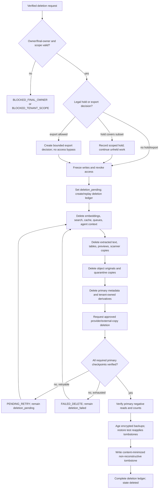

# Nova Trade Data Lifecycle, Export, Deletion, and Audit Policy

**Status:** Accepted local implementation contract; activation blockers remain
**Decision:** D-014
**Date:** 2026-07-27
**Scope:** Local implementation contract for tenant data lifecycle, export, deletion, legal hold, provider propagation, and content-minimized audit retention.
**Authority:** D-001, D-006, D-009, D-012, D-017, and D-018 govern the boundaries referenced here. This document does not approve production, legal compliance, a provider, a region, a DPA, or live connector/model use.

## 1. Executive decision and status

Nova Trade will use a tenant-scoped, purpose-limited, fail-closed lifecycle. Primary application deletion is authoritative for access and application-visible truth; deletion propagates to every derivative and storage surface through resumable checkpoints. Short-lived exports expire no later than seven days. Raw operational logs are retained for 30 days, raw connector/source observations for 180 days unless a shorter rule wins, and tenant business materials/approved derived knowledge while the tenant is active, subscribed, and authorized until supersession, tenant policy, or deletion. Verified primary deletion completes within 30 calendar days unless an active lawful hold blocks only its covered subset. Encrypted backups age out within 35 days after primary deletion, subject to documented provider limitations.

Content-minimized, non-reconstructive audit/protective tombstones have a seven-year default retention. They contain no raw content or contact points. The seven-year value is a protective default, not a claim about legal necessity; an approved lawful bound may require a different period.

### Current state versus future target

| State | Authoritative facts | Consequence |
|---|---|---|
| Current repository | The deployed path uses Supabase/Postgres and local development may use SQLite. The recovery contract covers a legacy 23-table application store. Existing caches, logs, exports, AI artifacts, and workers predate the complete tenant boundary. | Current behavior is not evidence of tenant-safe retention, export, deletion, provider propagation, or audit enforcement. No future policy may be inferred from an unscoped legacy row or cache hit. |
| Future target | Every tenant-owned record, object, queue, cache key, search/embedding entry, agent context, export, and content-bearing log has an effective tenant scope and lifecycle state. Deletion is a job with per-store receipts, and `deleted` is recorded only after required checkpoints pass. | Tenant-facing activation remains blocked until implementation, recovery, isolation, provider, legal/privacy, and security evidence satisfies the acceptance checklist. |

This is an accepted local implementation contract. It is not production, legal, or provider approval.

### Purpose and normative scope

This policy applies to tenant-owned business materials, research, source observations, accounts, contacts, knowledge, decisions, agents, outreach preparation, outcomes, exports, logs, caches, indexes, queues, backups, replicas, and audit records. `MUST`, `MUST NOT`, `SHOULD`, and `MAY` are normative. Platform-global reference data and authentication-provider records are outside tenant deletion unless expressly linked by a tenant-owned record; any remaining identity or platform record is handled by its own approved authority.

### Definitions

- **Primary/application-visible store:** The authoritative database and application-managed records from which an authorized request can read or mutate state.
- **Derived content:** Chunks, tables, claims, scores, summaries, prompts, outputs, embeddings, indexes, previews, and other material computed from tenant content.
- **Raw observation:** A connector response or source capture retained as an observation, with provenance and source policy.
- **Business-point freshness:** The 180-day re-verification/eligibility threshold for a business contact point or role. It is not an automatic deletion timer.
- **Deletion ledger:** The tenant-scoped durable record of a verified deletion request, scope, policy snapshot, checkpoints, holds, retries, receipts, and final result.
- **Receipt:** A durable, content-minimized record that a named store checkpoint was attempted and what verifiable result it produced. A request acknowledgment is not a deletion receipt.
- **Tombstone:** A content-minimized record retained to prevent identity reuse and preserve security/accounting/audit truth. A tombstone is not a backup, archive, or access grant.
- **Legal hold:** A separately authorized, reason-coded, scoped, reviewable instruction that pauses deletion only for covered records.
- **Provider transient state:** Prompt, response, scanner, connector, or other data held outside Nova Trade during one approved operation. Provider retention, region, backup, and deletion facts are unknown until evidenced.

## 2. Core invariants

1. **Tenant scope:** Every tenant-owned row, object, event, job, cache key, search/embedding entry, export, and content-bearing log MUST carry a server-derived tenant scope. A request-supplied tenant or workspace ID is a selector, never authority. Workspace scope is nullable only for an explicitly tenant-wide resource and can never widen access.
2. **Purpose limitation:** Data is collected, retained, exported, and disclosed only for the stated tenant-authorized purpose and approved operation. A deletion, export, support, or legal-hold record does not grant ordinary content access.
3. **Data minimization:** Store only the fields, derivative, locator, and audit metadata needed for the purpose. Never retain credentials, raw prompts, raw model outputs, raw document bodies, source excerpts, personal contact points, or customer-list rows in general logs or tombstones.
4. **Shortest-retention-wins:** The effective retention is the shortest applicable period among platform policy, source/provider terms, legal requirement, tenant policy, object expiry, and security/accounting limits. Unknown limits fail closed; they do not become unlimited.
5. **Freshness versus retention:** A stale business point or claim is re-verification-ineligible at the relevant threshold; it is not automatically deleted. Retention controls how long history is kept, while freshness controls whether current use is allowed.
6. **Archive versus deletion:** Archive/suspend preserves authorized history and blocks new work. Deletion revokes access, removes content and derivatives, ages backups, and leaves only allowed tombstones. An archive is never presented as deletion.
7. **Deletion truth:** `deletion_pending` means access is revoked but required work is incomplete; `deletion_failed` means required work remains incomplete after a failed or exhausted attempt; `deleted` means all required primary/application-visible checkpoints are verified. None of these states is silently treated as another.
8. **No cross-tenant reuse or training:** Tenant content, customer lists, contacts, embeddings, prompts, outputs, source observations, and private corrections MUST NOT be reused for another tenant, global retrieval, or model training. Approved non-content aggregates must remain non-reconstructive and tenant-partitioned.
9. **Provider honesty:** Provider region, retention, training use, abuse-monitoring, backup, DPA, and deletion behavior are unknown until evidenced. A configured, reachable, or mocked provider is not approved. No immediate provider-backup erasure claim is permitted.
10. **Suppression dominance:** `opt_out`, `do_not_contact`, complaint, bounce, deletion, source prohibition, unknown, and conflicted suppression states remain protective across workspaces and exports. A tenant retention policy cannot clear or weaken suppression truth.
11. **No policy-as-access:** Retention settings, export permissions, a legal hold, a tombstone, a source policy, and a worker lease never grant access. Authorization is separately evaluated from effective tenant/workspace membership, role, purpose, and lifecycle state.
12. **Append-only provenance:** Source observations, evidence, claims, reviews, approvals, outcomes, audit events, and deletion checkpoints are append-only or versioned. Corrections supersede; they do not erase the history needed to explain a decision.

## 3. Retention profiles and precedence

The following launch defaults are implementation policy values, not legal conclusions:

| Profile | Default | Tenant setting | Hard boundary |
|---|---|---|---|
| `EXPORT_7D` | Generated export artifacts expire and are deleted within 7 days maximum. | May shorten; MAY NOT lengthen. | Private, bounded access and expiry are mandatory. |
| `LOG_RAW_30D` | Raw operational application logs are retained 30 days, then deleted or reduced to an approved non-content aggregate. | May shorten; MAY NOT lengthen the raw period. | Secrets, prompts, outputs, document content, and contact points are never valid log fields. |
| `SOURCE_RAW_180D` | Raw connector/source observations are retained 180 days. | May shorten. | A shorter source/provider/tenant/legal rule wins; stale does not itself delete. |
| `CONTACT_FRESHNESS_180D` | Business-point freshness is re-verification/eligibility at 180 days. | May shorten the eligibility window. | It is not an automatic deletion rule; source/legal/tenant deletion can still delete earlier. |
| `ACTIVE_MATERIALS` | Tenant-owned active business materials and approved derived knowledge retain while tenant is active/subscribed and authorized, until supersession, tenant policy, or deletion. | May shorten by an explicit approved tenant policy and deletion workflow. | Source/provider/legal rules and holds win; no indefinite retention is implied after authorization ends. |
| `PRIMARY_DELETE_30D` | Verified tenant deletion from primary/application-visible stores completes within 30 calendar days. | MAY request earlier completion; MAY NOT extend this target. | An active lawful hold blocks only the held subset. |
| `BACKUP_35D` | Encrypted backup copies expire within 35 days after primary deletion. | MAY request earlier provider lifecycle expiry where supported. | Provider backup behavior remains an activation evidence item; restored data must reapply tombstones before access. |
| `TOMBSTONE_7Y` | Content-minimized security/accounting/protective tombstones retain 7 years by default. | MAY NOT shrink below an approved security/accounting floor; a documented lawful bound may alter the period. | Tombstones are non-reconstructive and never contain raw content/contact points. |

### Precedence algorithm

For each `(tenant, resource, operation)`:

1. Validate the request shape, immutable resource identity, tenant/workspace scope, policy version, and idempotency fields. Malformed or missing policy input fails closed.
2. Resolve the authenticated actor, membership/support grant, role, tenant/workspace lifecycle, purpose, and field permissions. A policy setting does not substitute for authorization.
3. Resolve source, provider, legal, jurisdiction, personal-data, suppression, and legal-hold constraints. Unknown source/provider/legal bounds are restrictive, not permissive.
4. Select the data-class profile. Compute `effective_retention = min(platform_default, tenant_policy_if_shorter, source_limit, provider_limit, legal_limit, object_expiry)` for ordinary content. If any required limit is unknown, block the operation that would widen or disclose data.
5. Apply non-configurable floors: `TOMBSTONE_7Y` cannot be shortened below its approved bound; security/accounting history cannot be deleted merely because ordinary content expired. The tombstone still cannot contain reconstructive content.
6. For contact use, evaluate D-012 suppression and freshness separately. A stale business point routes to re-verification/review; it does not become an automatic deletion.
7. For export, calculate included, redacted, suppressed, held, expired, and excluded records before artifact creation. For deletion, create or replay one deletion ledger and freeze/revoke access before per-store work.
8. Persist the policy version, input hash, decision, and reason. An unknown code, unknown policy, unresolved hold, or missing checkpoint prevents a success result.

Tenant policy may shorten most business retention but cannot widen source/provider/legal limits, bypass suppression, grant access, or shrink security/accounting tombstones below an approved floor. Tenant policy may not turn provider uncertainty into approval.

## 4. Exhaustive PRD Section 15 data-class lifecycle matrix

The 13 PRD Section 15 rows are expanded below into one row for every individual concept: 53 concepts total. `Tenant owner` means the accountable data-owner role, not a named person. `M` means `ACTIVE_MATERIALS`; `S` means `SOURCE_RAW_180D`; `L` means `LOG_RAW_30D`; `E` means `EXPORT_7D`; `T` means `TOMBSTONE_7Y` where required. Every row is tenant-scoped unless marked platform-global by D-001.

| # | Concept | System/data owner role; classification and purpose | Default retention; tenant bound or boundary | Export inclusion/redaction | Deletion/cascade behavior | Legal hold behavior | System of record/store surfaces | Required audit/tombstone |
|---:|---|---|---|---|---|---|---|---|
| 1 | `tenants` | Product/account owner; tenant identity, lifecycle, policy root; restricted account metadata. | M for active lifecycle; deletion ledger drives close; tenant cannot extend source/legal limits. | Include verified tenant identity and lifecycle manifest; redact internal provider/security fields. | Freeze on deletion; cascade all tenant-owned concepts and revoke access; retain non-reusable tenant tombstone. | Hold only scoped tenant content; identity and access revocation continue. | Postgres authoritative; SQLite compatibility fixture only; tenant key namespace; audit ledger. | Lifecycle transition, verified request, final-owner guard, and `T` tenant tombstone. |
| 2 | `workspaces` | Tenant owner; optional subdivision and scoped work context; non-public organizational metadata. | M until archive/deletion; no cross-tenant transfer; tenant may shorten workspace content retention. | Include authorized workspace metadata and scope; redact unrelated workspace identifiers. | Delete workspace-owned children; preserve tenant-wide accounts, contacts, documents, evidence, and suppressions. Old workspace ID is never reusable. | Hold only named workspace records; tenant-wide work continues. | Postgres; workspace-scoped keys, jobs, caches, search filters; audit. | Archive/delete transition, reassignment, and `T` non-reuse tombstone. |
| 3 | `memberships` | Identity/access owner; tenant membership and role binding, security data. | M while needed for access/accountability; revoked membership history follows T where protective. | Include actor role/status only to authorized admin export; redact identity details not required. | Revoke immediately; do not delete global Auth identity or another membership; retain protective membership tombstone. | Hold does not restore membership access; history may be held. | Supabase Auth reference plus tenant membership Postgres rows; audit. | Membership/revocation and `T` access-history tombstone. |
| 4 | `roles` | Platform security owner; platform-global role definitions and versioned permission semantics. | Versioned platform reference; retain as long as needed for audit, not tenant content. | Include role/version labels; redact internal security implementation. | Never cascade as tenant content; preserve version used by historical decisions. | Hold cannot grant a role or change definition. | Platform reference store/Postgres; audit/version catalog. | Role version reference; no content tombstone required unless tenant binding exists. |
| 5 | `connector_accounts` | Tenant operations owner; connector authorization, credential reference, health, and scope; secret references only. | M while enabled/authorized; credential material follows secret-store policy and source/provider shortest rule. | Include connector ID/status/policy version; never export credentials, tokens, or secret references that reveal them. | Disable/revoke before tenant deletion; delete secret reference/material through approved secret boundary; cascade runs only after revoke. | Hold can preserve non-secret authorization history, never active use. | Postgres registry; managed secret store reference; connector audit. | Disable/revoke receipt and `T` credential-free tombstone. |
| 6 | `source_policies` | Source-policy owner; terms, fields, personal-data classes, jurisdiction, freshness, raw retention, budget. | M/versioned while referenced; shorter source rule wins; no tenant widening. | Include policy ID/version and allowed-field manifest; redact credentials and private terms material. | Revoke future use; preserve version reference and delete tenant-specific secret/attestation details when due. | Hold does not reinstate source permission. | Postgres policy registry; source run/audit references. | Policy change/revocation and `T` policy-reference tombstone. |
| 7 | `source_runs` | Research operations owner; bounded execution metadata, query plan, lease, status, cost. | M for run history, with raw observations separately S; tenant may shorten history subject to accounting floor. | Include run manifest/status/counts/provenance; redact query content or personal data when not needed. | Cancel/freeze; cascade units, transient queues, and observations per class; preserve non-content result. | Hold named run metadata/content only; unrelated runs continue. | Postgres run tables; queue/lease records; audit and usage. | Run state/checkpoint and `T` run result tombstone. |
| 8 | `source_observations` | Source/data owner; immutable raw connector observations and provenance. | S: 180 days unless shorter source/provider/tenant/legal rule; freshness is separate. | Include permitted normalized fields, source IDs, times, locator, and redaction flags; exclude raw prohibited fields/contact points. | Delete raw observation and derived links on tenant deletion/expiry; preserve only non-content source/result tombstone. | Hold covered observation; source policy still blocks ordinary use; other observations continue. | Postgres source observation store; object raw capture if approved; cache only as scoped derivative. | Source receipt, retention decision, hash, and `T` non-content observation tombstone. |
| 9 | `documents` | Knowledge owner; tenant business material envelope, metadata, authorization, lifecycle. | M while authorized/active; tenant may shorten; D-006 state and source/legal rule wins. | Include metadata, version manifest, checksum, status, and authorized citations; redact bytes, secrets, and personal data. | Revoke access; cascade versions, objects, quarantine copies, derivatives, chunks, tables, claims, embeddings, and caches. | Held documents remain inaccessible to ordinary users and are excluded from deletion completion only if covered. | Postgres metadata; private Supabase Storage adapter; quarantine/scanner; audit. | Upload/scan/delete checkpoints and `T` document tombstone with no content. |
| 10 | `document_versions` | Knowledge/storage owner; immutable byte version, checksum, scanner and parser lineage. | M while authorized; temporary quarantine state expires under D-006; source/provider limit wins. | Include version ID, checksum, parser/scan status, locator metadata; never export raw bytes unless explicitly authorized and clean. | `deletion_pending` revokes URLs; delete original, quarantine, scanner copy, derivatives; `deleted` only after existence/read checks. | Covered version remains held/inaccessible; unrelated versions delete. | Postgres version row; private object/quarantine/scanner stores. | Scanner/delete receipt, checksum, checkpoint statuses, `T` version tombstone. |
| 11 | `document_chunks` | Knowledge/retrieval owner; extracted text retrieval units with locators and hashes. | M while source/version authorized; shorter source/legal/tenant rule wins. | Include chunk IDs, citations, hashes, and redacted text only where permitted; omit raw content by default. | Delete with document version; invalidate retrieval references and embeddings before final state. | Exclude held chunks from ordinary export/use; hold only covered lineage. | Postgres or approved derived store; search index; vector index; caches. | Derivative deletion receipt and `T` chunk-class tombstone. |
| 12 | `extracted_tables` | Knowledge/parser owner; structured cells/rows/columns for evidence and retrieval. | M while source/version authorized; parser output does not outlive the shortest source rule. | Include schema, locator, quality, and redacted allowed cells; sanitize formula values; omit sensitive cells. | Delete with document version; remove tables from search/vector/cache and citation graph. | Held tables remain blocked from ordinary access/export; no hold grant. | Postgres derived tables; private object derivatives; search/vector surfaces. | Parser/delete checkpoint and `T` table-class tombstone. |
| 13 | `evidence_items` | Evidence/privacy owner; provenance-bearing observation or extracted support. | M while referenced and authorized; stale/revoked evidence is retained only within policy. | Include evidence ID, grade, source/version, hash, locator, freshness, review state, and redaction; no forbidden excerpt. | Delete content and citations with source; preserve non-reconstructive decision/tombstone references. | Held evidence is not used or exported except scoped authorized hold review. | Postgres evidence graph; source/document references; audit. | Evidence state transition, citation resolution, and `T` evidence tombstone. |
| 14 | `claims` | Knowledge/product owner; normalized tenant assertion with scope, version, status, and action eligibility. | M until supersession, tenant policy, or deletion; stale is not deletion. | Include claim version, status, evidence refs, freshness/conflict, policy version, and redaction; omit sensitive values unless authorized. | Delete claim content and dependent scores/drafts; retain correction/retraction reason without reconstructive value. | Held claims remain blocked from ordinary use; unrelated claims proceed. | Postgres claim store; projections/search; audit. | Approval/correction/retraction and `T` claim-class tombstone. |
| 15 | `claim_support` | Evidence owner; append-only claim-to-evidence edges and support/conflict relationship. | M with claim/source, shortest parent rule wins. | Include edge type, evidence IDs, hashes, and redaction indicators; no raw source quote by default. | Delete edges when either content parent is deleted; preserve count/reason only in tombstone. | Hold covered edge; cannot make claim operational. | Postgres graph; citation indexes; audit. | Edge create/retract/checkpoint and `T` edge-class tombstone. |
| 16 | `claim_reviews` | Review owner; human decision, reviewer role, scope, version, reason. | M for decision reproducibility; protective decision metadata T. | Include decision state, actor role, policy/content hash, reason code; redact personal notes and private evidence. | Remove review content when allowed; retain non-content decision/tombstone for audit. | Hold preserves review history but does not approve or expose claim. | Postgres review/audit store. | Review decision and `T` protective decision tombstone. |
| 17 | `questions` | Product/knowledge owner; adaptive question, uncertainty, and answer purpose. | M until answered/superseded/tenant policy/deletion; tenant may shorten. | Include question text only to authorized scope; redact embedded content/contact data and prompt-like source material. | Cascade to question run links and derived answer context; preserve no-content status receipt. | Hold covered question history; no new access. | Postgres; agent artifact references; audit. | Question lifecycle and `T` decision tombstone if needed. |
| 18 | `question_runs` | Agent operations owner; bounded adaptive-question execution trace. | M for run accountability; raw transient prompt/output follows agent/provider rule. | Include run status, policy/version, counts, hashes, and safe reason codes; redact prompts/outputs. | Cancel and delete transient context; cascade unapproved question artifacts; retain checkpoint tombstone. | Hold covered run metadata only; worker remains denied ordinary use. | Postgres run/lease; queue; logs with redaction. | Lease/cancel/complete receipt and `T` run tombstone. |
| 19 | `answers` | Tenant knowledge owner; tenant-provided answer and provenance. | M while business understanding uses it; tenant may shorten by policy; personal data rules win. | Include authorized answer fields, version, provenance, and redaction; omit secrets and unnecessary personal data. | Delete answer and invalidate dependent understanding/plays/questions; preserve non-content dependency receipt. | Held answer excluded from new synthesis and export; hold does not authorize display. | Postgres; private document/source boundary; audit. | Answer version/change and `T` answer tombstone. |
| 20 | `business_understanding_versions` | Product/knowledge owner; approved tenant business model, evidence and uncertainty snapshot. | M until superseded/tenant policy/deletion; active authorization required. | Include version, approvals, evidence refs, uncertainty and redaction; omit raw source material. | Supersede or delete with dependencies; invalidate agent/ICP/play consumers; preserve version/result tombstone. | Hold covered version; dependent work revalidates and cannot bypass hold. | Postgres knowledge store; search/index projections; audit. | Approval/supersession and `T` version tombstone. |
| 21 | `icps` | Strategy owner; reusable target definition and policy container. | M while tenant strategy active; tenant may shorten; no source/legal widening. | Include authorized definition, status, version refs, and redaction; omit private notes not in scope. | Cascade versions and dependent plays/assessments according to retain-or-delete decision; no cross-tenant copy. | Hold covered strategy; dependent runs pause/revalidate. | Postgres strategy store; workspace filters; audit. | Activation/archive/delete and `T` strategy tombstone. |
| 22 | `icp_versions` | Strategy owner; immutable ICP decision version and evidence context. | M until superseded/tenant policy/deletion. | Include version/hash, evidence refs, status, policy, and redaction; no raw documents/prompts. | Delete/supersede dependent play references; preserve no-content version result. | Hold version and dependent decisions only. | Postgres version store; search projections. | Version transition and `T` version tombstone. |
| 23 | `lead_plays` | Strategy owner; tenant/workspace play, source, qualification, and outreach policy. | M while active/authorized; tenant may archive/delete earlier. | Include play ID, scope, status, policy versions, and authorized definitions; redact private strategy text as needed. | Freeze new runs, cascade scoped versions/runs/assessments/drafts; canonical tenant-wide records remain. | Hold play content/runs only; unrelated tenant-wide records continue. | Postgres strategy store; workspace-scoped jobs/indexes. | Activation/archive/delete and `T` play tombstone. |
| 24 | `lead_play_versions` | Strategy owner; immutable play rules/examples/counterexamples and supersession history. | M until superseded/tenant policy/deletion. | Include version/hash, source policy, score/outreach gates and redaction; no raw prompt or contact point. | Invalidate downstream assessments/drafts; preserve supersession reason tombstone. | Held version cannot activate or generate work. | Postgres versions; search cache; audit. | Version approval/supersession and `T` version tombstone. |
| 25 | `accounts` | Account/data owner; tenant-wide canonical organization projection. | M while tenant account exists; tenant may archive/delete; source/legal limits govern observations. | Include authorized account fields, evidence refs, identity state, and redaction; no foreign tenant or prohibited contact points. | Delete account links, projections, contacts/buying centers as scoped; observations follow their own retention; no cross-tenant transfer. | Hold covered account and dependent content; access remains restricted. | Postgres canonical account store; compatibility `leads` projection; search/index. | Merge/unmerge/delete and `T` non-reusable account tombstone. |
| 26 | `account_aliases` | Account identity owner; tenant-local names/domains/provider identifiers. | M with account or until source rule expires; tenant may shorten. | Include normalized alias and source namespace when authorized; redact exact sensitive identifiers if not necessary. | Delete aliases with account or revoke source mapping; identity tombstone prevents reuse. | Hold alias resolution; no merge/access grant. | Postgres identity graph; source observation references; caches. | Identity change and `T` hashed alias tombstone, not raw alias. |
| 27 | `account_relationships` | Account identity owner; parent/subsidiary/channel/branch relationship history. | M/versioned until supersession/deletion. | Include relationship type/state/evidence refs; redact private relationship notes. | Delete relationship edges with scoped accounts; preserve merge/unmerge reason history. | Hold covered relationship; no automatic merge or transfer. | Postgres relationship graph; search projections. | Relationship decision and `T` edge tombstone. |
| 28 | `account_observations` | Source/data owner; source-specific account history and provenance. | S: 180 days unless shorter source/provider/tenant/legal rule; freshness separate. | Include allowed normalized observation, source/version/time/hash; redact raw content/contact points. | Delete raw observation and recompute account projection; preserve count/hash reason only. | Hold observation only; source prohibition still blocks use. | Postgres source observations; object capture if approved; cache/index. | Observation receipt and `T` non-content observation tombstone. |
| 29 | `contacts` | Contact/data owner; tenant-wide business person/role record, personal-data protected. | M only while purpose/authorization exists; source/legal/tenant rule wins; no indefinite personal retention. | Include only permitted business-role fields after D-012; redact personal email/mobile and suppressed points. | Delete contact and dependent role hypotheses/drafts; suppression/deletion identity tombstone remains. | Hold covered contact data inaccessible to ordinary users; suppression still dominates. | Postgres contact store; no global directory; cache/index scoped. | Contact deletion/suppression and `T` hashed identity tombstone with no point. |
| 30 | `contact_observations` | Contact/data owner; source, role, point, freshness and provenance observation. | S: 180 days maximum for raw source observation; 180-day business freshness is re-verification, not deletion. | Export role/source/freshness only when permitted; redact contact point unless D-012 allows exact field. | Delete raw observation/point; invalidate permissions and drafts; retain suppression reason without point. | Hold covered observation but do not authorize contact use. | Postgres; private source/object boundary; cache/index. | Observation receipt, freshness decision, and `T` point-free tombstone. |
| 31 | `contact_permissions` | Privacy/compliance owner; permitted-use, attestation, lawful basis, channel, jurisdiction, freshness. | M only while authorization remains current; shorter source/legal/tenant rule wins. | Include permission state/version and reason; redact personal identifiers and legal notes not needed. | Revoke immediately; delete permission content with contact; preserve protective decision tombstone. | Hold does not create permission or extend a source right. | Postgres policy state; D-012 evaluator cache; audit. | Permission decision/revocation and `T` protective tombstone. |
| 32 | `suppressions` | Privacy/compliance owner; opt-out, do-not-contact, complaint, bounce, source prohibition, deletion state. | T protective history; raw contact point is not retained in tombstone. | Include effective disposition/reason/scope; redact contact point and personal details. | Never clear through ordinary deletion; retain non-reconstructive suppression tombstone and invalidate all handoffs. | Hold may preserve suppression history; suppression continues to block. | Postgres authoritative suppression; scoped decision cache; audit. | Every protective transition and `T` point-free suppression tombstone. |
| 33 | `buying_centers` | Account/strategy owner; tenant account-level purchase committee model. | M while account/strategy active; tenant may shorten. | Include role structure and evidence refs; redact personal contact data and private notes. | Delete with account/strategy scope; role projections and scores re-evaluate. | Hold covered buying-center content; no outreach grant. | Postgres; search projections; audit. | Version/change and `T` buying-center tombstone. |
| 34 | `buying_center_roles` | Strategy/data owner; tenant role definitions and relationship to a buying center. | M/versioned while strategy active; supersede/delete under policy. | Include role label/state/evidence refs; redact person-level points. | Delete with buying center or play; preserve non-content role-state reason. | Hold covered roles; do not expose underlying contact. | Postgres strategy/account store; search/index. | Role definition change and `T` role tombstone. |
| 35 | `role_hypotheses` | Review/data owner; inferred or proposed account/contact role, never verified identity by itself. | M until superseded/stale/deletion; freshness rules may block use without deletion. | Include hypothesis status/confidence dimension/evidence refs; redact personal points. | Delete with contact/account scope; invalidate qualification/drafts; preserve no-content review result. | Hold hypothesis; cannot satisfy contact-use gate. | Postgres review/knowledge store; search cache. | Review/state change and `T` hypothesis tombstone. |
| 36 | `qualification_assessments` | Qualification owner; play-specific evidence-backed decision snapshot. | M until superseded/tenant policy/deletion; stale is not deletion. | Include decision, factors, evidence refs, freshness, reviewer and redaction; omit raw notes. | Delete scoped assessment and recompute dependent queue/draft; account remains if tenant-wide. | Hold assessment and downstream decision; no silent reuse. | Postgres assessment store; queue/search projections; audit. | Assessment decision and `T` result tombstone. |
| 37 | `score_snapshots` | Data/strategy owner; reproducible score version and input hash. | M until superseded/tenant policy/deletion. | Include score version, factors, evidence refs, status and redaction; no hidden personal data. | Delete snapshots with play/account scope; invalidate queue ordering and drafts. | Hold snapshot; no score-based access or outreach. | Postgres score store; search/index/cache. | Re-score/version and `T` score tombstone. |
| 38 | `score_factors` | Data/strategy owner; explainable factor values and contributions. | M with score snapshot; shortest evidence/source rule wins. | Include permitted factor names/values and source refs; redact sensitive inputs. | Delete with snapshot; no orphaned factor cache. | Hold factors with snapshot. | Postgres; search/index/cache. | Factor calculation/delete receipt and `T` factor tombstone. |
| 39 | `manual_overrides` | Reviewer/strategy owner; reasoned human correction to assessment or score. | M for reproducibility; protective decision metadata T. | Include actor role, reason code, version/hash, and redaction; omit private commentary. | Delete override effect and recompute; retain non-content correction reason. | Hold preserves history but does not grant authority. | Postgres audit/assessment store. | Override/reversal and `T` correction tombstone. |
| 40 | `agent_runs` | Agent operations owner; bounded tenant/workspace execution and lease. | M for run accountability; raw transient context is not durable by default. | Include status, policy/model version, input hash, cost, counts, and safe reason; redact prompts/outputs. | Cancel/revoke; delete context and derivatives; preserve run checkpoint tombstone. | Hold run metadata/content only; no agent continuation without authorization. | Postgres run/lease; queue; redacted logs; provider adapter. | Lease/state/delete receipt and `T` run tombstone. |
| 41 | `agent_steps` | Agent operations owner; step state, input/output hashes, retry and gate result. | M for reproducibility; raw prompt/output not retained absent explicit approval. | Include step status, code, hashes, evidence refs, and redaction; omit bodies. | Delete step content/context with run; preserve counts/checkpoint status. | Hold covered step metadata; ordinary retrieval remains blocked. | Postgres; queue; logs/telemetry. | Step checkpoint and `T` non-content step tombstone. |
| 42 | `tool_calls` | Security/agent owner; allowlisted tool invocation metadata, not credentials. | L for operational details; approved non-content aggregate may remain; raw arguments are excluded. | Include tool name, status, timing, policy and hashes; redact arguments/results/secrets. | Revoke queued call, delete transient arguments/results, preserve failure reason. | Hold metadata only; never permits replay. | Postgres audit/run store; queue; redacted logs. | Tool authorization/result and `T` tool-call tombstone. |
| 43 | `agent_artifacts` | Knowledge/agent owner; proposals, summaries, outputs, and derived artifacts with version/hash. | M for approved derived knowledge; raw proposal/output is tenant material and may shorten; provider rule wins. | Include approved/redacted artifact version and evidence refs; exclude raw prompts, forbidden outputs, secrets. | Delete artifacts and downstream indexes/embeddings; invalidate approvals and claims. | Hold covered artifact; no use or export outside hold authority. | Postgres artifact store; private object store; search/vector/cache. | Artifact state/delete receipt and `T` artifact tombstone. |
| 44 | `agent_feedback` | Learning/product owner; tenant correction, review feedback, and aggregate learning input. | M while needed for tenant learning; cross-tenant aggregate only after non-reconstructive review. | Include redacted correction/result and version/hash; omit raw prompts/outputs and personal data. | Delete tenant feedback and invalidate derived proposals; no global reuse. | Hold feedback and dependent proposal; no training/use expansion. | Postgres feedback store; approved aggregate analytics only. | Feedback correction/delete and `T` feedback tombstone. |
| 45 | `review_tasks` | Review owner; human queue item and required gate context. | M until completed/superseded/deletion; protective decision metadata T. | Include task status, scope, claim/version refs, reason, and redaction; no private source excerpt. | Cancel/delete task and dependent unapproved artifact; completed decision follows audit retention. | Hold task; keep blocked and visible only to authorized reviewer. | Postgres review queue; audit. | Assignment/decision/delete and `T` task tombstone. |
| 46 | `approvals` | Review/security owner; exact version/hash approval and separation-of-duty context. | M for approval reproducibility; protective metadata T. | Include approved version/hash, role, policy snapshot, timestamp, reason, and redaction; no raw evidence. | Revoke on material change/suppression/deletion; preserve approval invalidation reason. | Hold can preserve approval history but never make held content releasable. | Postgres approval store; audit; export manifest references. | Approval/revocation and `T` approval tombstone. |
| 47 | `outreach_drafts` | Outreach/product owner; human-reviewed, cited draft version; no send authority. | M while approved tenant strategy and evidence remain authorized; contact/source rules may shorten. | Include exact approved version, citations, redaction, and recipient class only if D-012 allows; no personal defaults. | Revoke drafts on deletion/suppression; delete content and artifacts; preserve handoff/audit result without body. | Hold blocks release and ordinary access to covered draft. | Postgres draft store; private export artifact; cache only scoped. | Version/approval/handoff and `T` draft tombstone with no body. |
| 48 | `outreach_events` | Outreach/audit owner; append-only copy/export/manual handoff event, not delivery truth. | M while outcome/audit needed; raw message bodies are not required and follow shortest rule. | Include event type, version/hash, actor, result, citations, redaction; never imply sent/delivered. | Delete message content and contact linkage where allowed; preserve non-content event/tombstone. | Hold covered event history; no new handoff. | Postgres event/audit store; export manifest references. | Event and `T` no-body event tombstone. |
| 49 | `outcomes` | Outcome owner; manually reported reply/meeting/win/loss/protective result. | M while account/strategy history needed; personal data/source rule wins. | Include canonical outcome, timestamp, version linkage, suppression effect, and redaction; no unverified delivery claim. | Delete outcome content with tenant scope; preserve protective suppression/audit tombstone. | Hold covered outcome; suppression still dominates. | Postgres outcomes; reporting projections; audit. | Outcome/correction and `T` outcome tombstone. |
| 50 | `usage_events` | Finance/operations owner; tenant cost, provider/source, run, actor, and budget attribution. | L raw operational detail 30 days, then approved non-content aggregate; accounting floor may require T. | Include counts/cost class/status and aggregate IDs; redact credentials, prompts, source content. | Delete raw detail after profile; retain approved non-content accounting/tombstone. | Hold accounting record; no access to content. | Postgres usage/audit store; analytics aggregate. | Usage settlement and `T` accounting tombstone. |
| 51 | `budgets` | Finance/operations owner; tenant/workspace caps, reservations, and kill state. | M while policy/accounting active; protective history T. | Include budget class/limit/status/usage aggregate; redact provider credentials and private inputs. | Disable budget and queued work; retain final accounting reason/tombstone. | Hold cannot reopen a budget or authorize work. | Postgres policy/usage store; worker lease. | Budget change/kill and `T` budget tombstone. |
| 52 | `audit_events` | Security/privacy owner; append-only actor, scope, action, reason, policy, result, and checkpoint metadata. | L content-bearing raw detail 30 days; non-content protective/audit tombstone T7Y default. | Include safe event metadata, hashes, counts, statuses, and references; forbid raw content/contact points/secrets. | Delete content-bearing details per profile; retain allowed non-reconstructive audit tombstone. | Hold may preserve covered audit history; ordinary access remains role-gated. | Postgres audit log authoritative; telemetry derivative; recovery manifest. | Always required; `T` is the retained representation, never a content archive. |
| 53 | `retention_jobs` | Security/privacy operations owner; export/delete/expiry execution ledger and checkpoints. | M until terminal result, then L/T according to content-free status; tenant may shorten non-protective detail. | Include job scope, manifest, checkpoints, counts, policy, result, and redaction; omit content and secrets. | Complete after child stores; delete job detail when allowed while retaining final tombstone. | Hold causes scoped pause/review; unheld checkpoints continue. | Postgres deletion ledger; queue/lease; audit; provider receipts. | Every checkpoint, retry, receipt, and final `T` deletion ledger tombstone. |

### Matrix coverage statement

The matrix covers the PRD groups in order: tenancy (`tenants` through `roles`); connectors (`connector_accounts` through `source_observations`); documents (`documents` through `extracted_tables`); evidence (`evidence_items` through `claim_reviews`); understanding (`questions` through `business_understanding_versions`); strategy (`icps` through `lead_play_versions`); accounts (`accounts` through `account_observations`); contacts (`contacts` through `suppressions`); buying centers (`buying_centers` through `role_hypotheses`); qualification (`qualification_assessments` through `manual_overrides`); agents (`agent_runs` through `agent_feedback`); review/outreach (`review_tasks` through `outcomes`); and operations (`usage_events` through `retention_jobs`). No concept is represented only by a grouped label.

## 5. Storage-surface lifecycle matrix

The following surfaces are separately checkpointed. A delete receipt means a verifiable store operation, not merely a parent-row update.

| Surface | Data and default handling | Delete receipt/checkpoint | Failure behavior |
|---|---|---|---|
| Postgres / SQLite | Postgres is authoritative for tenant lifecycle, policy, ledger, and future tenant data. SQLite is local compatibility/test storage and cannot prove RLS or production isolation. | Transaction ID/ledger checkpoint, row counts by opaque class, negative read check, and final commit receipt; SQLite fixture receipt is separate. | Roll back a failed transaction; mark `deletion_pending` or `deletion_failed` if application-visible rows remain. Never report `deleted` from a partial transaction. |
| Object storage / quarantine / scanner copies | Private tenant-namespaced originals, derivatives, quarantine objects, previews, and scanner-side copies; clean-only access per D-006. | Exact object class/opaque ID, adapter delete result, existence check where supported, scanner cleanup receipt, and timestamp. | Revoke signed access immediately; retry transient errors; unresolved provider copy becomes `deletion_failed` and remains inaccessible. |
| Extracted text / tables | Versioned chunks, spans, tables, locators, and parser derivatives. | Count/hash checkpoint for each document version and negative citation/read check. | Keep parent deletion pending; do not claim source deleted while extracted content remains. |
| Embeddings / vector / search index | Tenant-scoped retrieval entries derived from clean content; no cross-tenant reuse. | Namespace delete/invalidate receipt, entry count, generation/version, and retrieval negative test. | Quarantine index generation, deny retrieval, retry; stale index is not a successful deletion. |
| Cache / idempotency / queues | Tenant-scoped cache entries, decision caches, idempotency records, worker jobs, leases, dead letters, and transient payloads. | Namespace invalidation, queue drain/cancel, lease revoke, idempotency state receipt, and no-hit replay check. | Cancel/revoke work; retain only content-free retry/tombstone metadata; a live lease or payload keeps deletion pending. |
| Browser / client state | Query caches, selected workspace, drafts, downloads, signed URLs, local storage, service-worker state. Signed URLs MUST NOT be persisted. | Client cache epoch/revocation event, server session invalidation, and browser storage clear receipt where controlled. | Server denies stale context; instruct/retry client purge; client uncertainty never blocks primary deletion but prevents access. |
| Generated export artifacts | Private short-lived CSV/JSON/package artifacts and manifest/checksum. | Artifact revoke/delete receipt, expiry timestamp, one-time/bounded access record, and object existence check. | Revoke access immediately; retry deletion; `BLOCKED_EXPORT_EXPIRED` or `FAILED_STORE_CHECKPOINT`, never a live artifact after expiry. |
| Agent / provider transient state | Request-scoped prompts, outputs, tool arguments, scanner/connector transient state; raw provider retention is not assumed. | Adapter completion/abort and provider delete receipt where contract exists; input/output hash and no-content local receipt. | Keep provider live use disabled when retention/deletion is unknown; cancel locally, escalate evidence gap, and do not claim provider erasure. |
| Logs / telemetry | Raw operational logs 30 days, redacted before emission; approved non-content aggregates may remain. | Retention sweep run, redaction check, partition/object delete receipt, aggregate classification receipt. | Redaction failure blocks work and emits only a privacy-safe incident; deletion failure remains pending/failed with no raw content exposure. |
| Analytics aggregates | Non-content, tenant-partitioned counts/trends after raw log expiry; no reconstruction of a tenant record or contact. | Aggregate classification/hash, tenant partition check, source-window receipt, and deletion of reconstructive inputs. | Do not aggregate unknown/raw data; discard or quarantine an unsafe aggregate and record a reason code. |
| Backups / replicas | Encrypted provider-managed copies and replicas; application cannot claim immediate erasure. | Primary deletion timestamp plus backup-age checkpoint, expiry policy receipt, restore tombstone-application test, and provider evidence. | Primary stays deleted/inaccessible; backup aging remains tracked. Restore must reapply deletion ledger/tombstones before access. |
| External connectors / CRM / import copies | Launch has no live CRM sync or connector write; approved sources may hold observations or import copies under source policy. | Connector delete request/receipt, import-copy namespace checkpoint, source policy version, and provider response. | Disable adapter, retry/escalate, keep source/tenant access revoked, and map unknown provider response to pending/failure. No immediate provider backup-erasure claim. |

## 6. Export contract

An export is a bounded, authenticated, tenant-scoped job or artifact, never a permission bypass and never a deletion substitute.

1. **Verify requester:** Resolve authenticated identity, active membership or scoped support grant, role/permission, tenant/workspace scope, tenant lifecycle, purpose, and field policy. Foreign protected objects return a non-enumerating 404-style result.
2. **Freeze a snapshot:** Record `snapshot_at`, effective scope, policy versions, source/claim/contact freshness state, legal holds, suppression epoch, and an immutable input hash. The export must be internally consistent for that snapshot.
3. **Manifest and schema:** Include `artifact_id`, `schema_version`, `contract_version`, tenant/workspace scope, requester/producer actor layer, `generated_at`, `expires_at`, policy snapshot, counts, exclusion reasons, checksums, and correlation/idempotency identifiers.
4. **Inventory classifications:** For every field/class, record included, redacted, suppressed, held, expired, or excluded status. Include source/provenance IDs, evidence/citation locators, claim versions, freshness, review/conflict state, and redaction indicators when those are in scope.
5. **Apply suppression and redaction:** D-012 suppression dominates recipient exports. Personal email/mobile, credentials, secrets, raw prompts/outputs, raw document chunks, forbidden source fields, and held records are excluded or deterministically redacted. A suppressed contact may be represented only by a non-reconstructive protective tombstone where the authorized administrative purpose allows it.
6. **Preserve provenance:** Citations must resolve within the requester's tenant/workspace and include source/version/hash/locator/policy facts. An omitted citation is not represented as proof. Formula-like CSV cells are sanitized according to D-017, with raw source retained only in protected internal records when policy permits.
7. **Create private artifact:** Store the artifact in a private tenant namespace with a short-lived, object-specific capability. It expires and is deleted after at most seven days, may be one-time or bounded-use, and is never a public URL. The artifact is not a CRM write, send, delivery, or approval.
8. **Audit and replay:** Persist one immutable export request/result with idempotency key and input hash. Same key plus same hash replays the same durable result without a second artifact; same key plus different hash returns `BLOCKED_EXPORT_REPLAY_CONFLICT` and creates no artifact.
9. **Exclusion reasons:** Report safe counts and reason codes for suppression, legal hold, stale/expired data, source prohibition, personal-data restriction, foreign scope, unavailable provider evidence, and redaction. Do not reveal foreign object existence.
10. **No bypass:** Export cannot bypass tenant/workspace authorization, legal hold, source/provider terms, personal-data restrictions, D-008 citation gates, D-012 suppression, or deletion state. An export requested during deletion is limited to the authorized deletion/status manifest and does not revive ordinary content access.

## 7. Deletion contract

### Truth and scope

Deletion is a verified, idempotent job. It may target a tenant, workspace, document/version, account, contact, source run, artifact, or another explicitly owned scope. A workspace deletion removes workspace-owned content and associations but not tenant-wide canonical accounts, contacts, documents, evidence, or suppressions. A tenant cascade covers every tenant-owned concept and all derived/storage surfaces. Deleted identities, tenant IDs, workspace IDs, account IDs, contact IDs, document IDs, and external identity tuples are never reused.

`deletion_pending` is set only after request verification and access freeze/revocation. `deletion_failed` is set when a required checkpoint is unresolved after bounded retry or is otherwise failed; access remains denied. `deleted` requires primary/application-visible verification, completed required derivative/index/cache/queue checkpoints, provider requests where applicable, and no outstanding readable content or provider delete retry within the application-controlled boundary. Backup aging is tracked after primary deletion and does not make the primary state ambiguous.

### Mermaid flow



### Ordered contract

1. Verify requester, final-owner invariant, exact scope, authorization, lifecycle, policy version, idempotency key, and whether the request is tenant, workspace, document/version, account, contact, or artifact scoped.
2. Resolve legal holds and any authorized export decision. A hold is not inferred from a request, and an export cannot expose content that deletion or policy forbids.
3. Freeze new writes, cancel or pause new work, revoke sessions/capabilities/signed URLs, invalidate retrieval and decision caches, and set `deletion_pending` in the same authoritative transaction as the deletion ledger handoff.
4. Process per-store checkpoints in the order above. Each checkpoint is tenant-scoped, idempotent, lease-protected, and records attempt/result/checkpoint status without content.
5. Request deletion from approved connectors, scanners, CRM/import adapters, and provider copies when their contract supports it. Record request, response, retry, and escalation separately.
6. Verify primary/application-visible absence, no readable derivative, no active queue/lease, no searchable/embeddable content, and no outstanding application-controlled provider retry. If any required checkpoint fails, stay pending or failed and deny access.
7. Record backup aging and restore behavior. A restored backup must apply the deletion ledger and tombstones before any access or rehydration; it must not recreate a deleted tenant, identity, contact, or object.
8. Write only allowed tombstone metadata, mark the ledger `deleted`, and return completion only after the durable transaction commits. A lost response is replayed from the ledger.

### Cancel, retry, partial failure, and restore

The conservative cancel window exists only before execution starts, while the request is verified but before freeze/first deletion checkpoint. After freeze, cancellation cannot restore access or reverse a completed checkpoint; it may stop future work and leave `deletion_pending` for an authorized retry. Retries use the same deletion identity and input hash. A different hash for the same identity is a conflict. Partial failure never reports completion. A restored backup is treated as untrusted until tombstones/deletion ledger are applied, access is disabled, and negative checks pass.

## 8. Legal holds

- A hold is separately authorized by the applicable legal/privacy/security process, reason-coded, tenant-scoped, and narrowed to tenant, workspace, document/version, account/contact, source observation, event, or other explicit object classes. It has an activation time, review/expiry date, owner role, and immutable history.
- Hold activation blocks deletion only for the covered subset. Freeze, access revocation, suppression, source prohibition, log redaction, unheld deletion, backup aging for unheld content, and unrelated tenant work continue.
- A hold is not an ordinary access grant. A reviewer receives only the separately authorized fields and purpose; the hold does not permit retrieval, export, model use, contact use, or outreach.
- Hold release is an append-only event. The next deletion worker re-evaluates policy and resumes the held subset with the original deletion identity; it does not silently restart a new tenant lifecycle.
- If counsel or an authorized reviewer identifies a conflict between hold scope and deletion/audit requirements, activation of the conflicting action remains blocked. This policy does not invent a legal conclusion. The conflict, scope, and safe stop are recorded without exposing held content.
- A hold cannot shorten or widen retention, clear suppression, preserve raw content in a tombstone, or make a deleted identity reusable.

## 9. Provider and subprocessor deletion

Every future provider/scanner/connector adapter MUST expose, at minimum:

```text
delete(scope, object_class, opaque_object_id, deletion_id, policy_version)
  -> { accepted | deleted | not_found | retryable | failed,
       provider_operation_id?, receipt_hash?, observed_at, reason_code }
```

The adapter contract must bind the request to tenant scope, object class, policy version, and deletion identity; accept `not_found` only when the application can establish that it is safe; and never treat a malformed or ambiguous response as deletion. The adapter records request and receipt metadata without raw content, credentials, or provider payload bodies.

Provider region, retention, DPA, training/secondary-use, backup, replica, scanner-copy, and deletion facts are **unknown until evidenced** for the selected deployment and tenant/jurisdiction. A provider may accept a delete request while retaining encrypted backups or replicas under its own contract. Nova Trade therefore may state that it requested deletion and verified its application boundary; it may not claim immediate erasure from provider backups or provider systems without evidence.

Transient provider outage or timeout yields `PENDING_RETRY` or `FAILED_PROVIDER_RESPONSE` according to retry policy and keeps the relevant scope inaccessible. An invalid receipt yields `FAILED_PROVIDER_RESPONSE`, not `deleted`. Bounded retry and escalation are required. Production activation is blocked until the adapter's region, retention, deletion, incident, and evidence contract is approved.

## 10. Audit and tombstone schema

### Allowed fields

Audit events and tombstones MAY contain:

- opaque object-class and object-ID hashes, tenant tombstone ID, and non-reusable identity marker;
- tenant/workspace tombstone IDs where needed to prevent reuse, never raw content identifiers in a generally readable export;
- request, deletion, export, correlation, idempotency, and policy-version references;
- created/started/completed/expiry/hold-review timestamps;
- action, lifecycle state, result code, reason code, legal-hold reference, and source/provider policy reference;
- counts, byte/count classes, checkpoint names/statuses, retry counts, receipt hashes, and safe provider operation IDs;
- actor layer/role reference and worker lease reference, with access controlled separately.

### Forbidden fields

Audit events and tombstones MUST NOT contain raw documents, document chunks, extracted tables, prompts, model outputs, source excerpts, message bodies, contact points, names, personal email/mobile, customer-list rows, credentials, secrets, access tokens, signed URLs, reversible personal data, or content-derived fields that permit reconstruction. A hash is not a license to retain a reversible lookup table. Raw provider payloads are forbidden unless a separate approved incident boundary requires them outside the ordinary tombstone schema.

### Audit truth

Audit history is append-only. A delete request, retry, failure, hold, release, export, redaction, suppression, provider request, and completion each append an event. A tombstone records that a protected object existed and what lifecycle result occurred; it does not prove that a provider erased its backups. Support and audit readers still require explicit authorization.

## 11. Stable lifecycle/result codes and HTTP mapping

The following canonical result-code list is the only lifecycle/result vocabulary for this policy. Each code appears once in the canonical table; scenario rows below select exactly one code. Domain-specific underlying codes from D-008, D-012, D-017, or D-009 may be retained in an audit detail field only when they do not change the canonical outcome here.

| Canonical code | Meaning |
|---|---|
| `OK_EXPORT_READY` | Authorized export artifact created with manifest, redaction, checksum, and expiry. |
| `OK_DELETE_COMPLETE` | Required primary/application-visible deletion checkpoints verified and tombstone committed. |
| `OK_DELETE_ALREADY_COMPLETE` | Idempotent replay found the same deletion already complete. |
| `OK_REPLAY_SAME_INPUT` | Same identity and input hash replayed the same durable result without duplicate work. |
| `REVIEW_REQUIRED` | Authorized review is required before the requested lifecycle action can proceed. |
| `REVIEW_HOLD_REQUIRED` | Hold scope or counsel conflict requires authorized review; no covered action proceeds. |
| `UNAUTHENTICATED` | Authentication is absent or invalid. |
| `NOT_FOUND_NON_ENUMERATING` | Object is absent or outside the caller's authorized scope; no existence is disclosed. |
| `BLOCKED_TENANT_SCOPE` | Tenant assertion, parent, lease, or effective tenant scope conflicts. |
| `BLOCKED_WORKSPACE_SCOPE` | Workspace is foreign, invalid, archived for the action, or inconsistent with tenant scope. |
| `BLOCKED_PERMISSION` | Authenticated actor lacks the required permission or support grant. |
| `BLOCKED_FINAL_OWNER` | Deletion would violate the final-owner/account-ownership guard. |
| `BLOCKED_LEGAL_HOLD_SCOPE` | Requested action covers an active hold and is not an authorized hold operation. |
| `BLOCKED_POLICY_UNKNOWN` | Required retention, source, provider, legal, jurisdiction, or policy input is unknown/malformed. |
| `BLOCKED_POLICY_WIDEN` | Tenant or caller attempts to widen a platform/source/provider/legal retention or access boundary. |
| `BLOCKED_POLICY_TOMBSTONE_FLOOR` | Tenant or caller attempts to shrink an approved security/accounting tombstone floor. |
| `BLOCKED_SOURCE_LIMIT` | Source/provider/legal source limit is shorter or prohibits the operation. |
| `BLOCKED_FRESHNESS_REVIEW` | Freshness threshold requires re-verification/review; this is not deletion. |
| `BLOCKED_CONTACT_SUPPRESSED` | Effective D-012 suppression or deletion state blocks contact use/export. |
| `BLOCKED_PERSONAL_DATA` | Requested field or purpose is not permitted for personal-data handling. |
| `BLOCKED_QUARANTINE` | Content is quarantined, infected, scanner-error, or otherwise not clean-only eligible. |
| `BLOCKED_EXPORT_REDACTION` | Export cannot satisfy mandatory field minimization/redaction. |
| `BLOCKED_FORBIDDEN_CONTENT` | Content violates minimization or non-reconstructive boundaries even when it is not personal data. |
| `BLOCKED_EXPORT_HOLD` | Export intersects a held subset and cannot be authorized for that purpose. |
| `BLOCKED_EXPORT_EXPIRED` | Export artifact or access capability has expired/revoked. |
| `BLOCKED_EXPORT_REPLAY_CONFLICT` | Same export identity was reused with a different input hash. |
| `BLOCKED_IDENTITY_REUSE` | Deleted tenant/workspace/object identity or external tuple was reused. |
| `BLOCKED_MALFORMED` | Input, schema, scope, checksum, or version is malformed. |
| `BLOCKED_STATE_CONFLICT` | Lifecycle state cannot accept the requested transition. |
| `BLOCKED_VERSION_CONFLICT` | Expected version/hash does not match the durable object. |
| `BLOCKED_CONNECTOR_DISABLED` | Connector/provider/integration is disabled or not activated. |
| `PENDING_DELETE` | Deletion is frozen and running or waiting for a bounded retry. |
| `PENDING_RETRY` | A retryable store/provider/worker failure is scheduled; no completion is claimed. |
| `FAILED_DELETE` | Required deletion checkpoint failed or exhausted; access remains denied. |
| `FAILED_PROVIDER_RESPONSE` | Provider response was invalid, ambiguous, or non-retryable for the requested operation. |
| `FAILED_PROVIDER_OUTAGE` | Provider outage exceeded the bounded retry policy; the scope remains inaccessible. |
| `FAILED_TIMEOUT` | Provider or store operation timed out and the request reached its timeout boundary. |
| `FAILED_STORE_CHECKPOINT` | A required local store/index/cache/object checkpoint failed. |
| `FAILED_SCANNER` | Scanner did not produce a trustworthy clean/deletion result. |
| `FAILED_INTERNAL` | Unexpected internal failure; safe state is preserved and operator review is required. |
| `BLOCKED_RATE_LIMIT` | Bounded operation or retry rate limit was exceeded. |

HTTP transport mapping is separate from domain codes and is consistent:

| HTTP | Use |
|---:|---|
| 400 | Malformed input, schema, checksum, missing required field, or invalid policy shape (`BLOCKED_MALFORMED`). |
| 401 | Missing/invalid authentication (`UNAUTHENTICATED`). |
| 403 | Authenticated but unauthorized policy/permission/suppression/hold/source/content boundary (`BLOCKED_PERMISSION`, `BLOCKED_POLICY_*`, `BLOCKED_CONTACT_SUPPRESSED`, `BLOCKED_PERSONAL_DATA`, `BLOCKED_FORBIDDEN_CONTENT`, `BLOCKED_QUARANTINE`). |
| 404 | Absent or foreign protected object without enumeration (`NOT_FOUND_NON_ENUMERATING`). |
| 409 | State/version/hold/idempotency conflict (`BLOCKED_STATE_CONFLICT`, `BLOCKED_VERSION_CONFLICT`, `BLOCKED_LEGAL_HOLD_SCOPE`, `BLOCKED_EXPORT_REPLAY_CONFLICT`, `BLOCKED_IDENTITY_REUSE`). |
| 429 | Rate limit (`BLOCKED_RATE_LIMIT`). |
| 500 | Unexpected internal/store failure (`FAILED_INTERNAL`, `FAILED_STORE_CHECKPOINT`, `FAILED_DELETE`). |
| 502 | Invalid or ambiguous provider response (`FAILED_PROVIDER_RESPONSE`). |
| 503 | Disabled provider, outage, or retry pending (`BLOCKED_CONNECTOR_DISABLED`, `PENDING_RETRY`, `FAILED_SCANNER`). |
| 504 | Provider/store timeout (`FAILED_TIMEOUT`). A separate asynchronous retry may remain recorded as `PENDING_RETRY`, but the timed-out request is not reported as success. |

## 12. Deterministic golden, adversarial, and recovery scenarios

Each row has one and only one expected canonical result code. Fixture data is synthetic and tenant-scoped. `A` and `B` denote distinct tenants; `W-A` belongs to A and `W-B` belongs to B.

| ID | Scenario | Expected canonical result code |
|---|---|---|
| GL-001 | Tenant A reads a Tenant B document ID with an authenticated A session. | `NOT_FOUND_NON_ENUMERATING` |
| GL-002 | Tenant A submits Tenant B's workspace ID with an A tenant selector. | `BLOCKED_WORKSPACE_SCOPE` |
| GL-003 | A worker lease for A receives a deletion payload naming B. | `BLOCKED_TENANT_SCOPE` |
| GL-004 | A workspace-local export omits workspace scope and would broaden to tenant data. | `BLOCKED_WORKSPACE_SCOPE` |
| GL-005 | A valid tenant owner requests an account export within A's scope. | `OK_EXPORT_READY` |
| GL-006 | A support actor has no active, reason-coded grant and requests document content. | `BLOCKED_PERMISSION` |
| GL-007 | A final-owner deletion request would leave the tenant without its required owner. | `BLOCKED_FINAL_OWNER` |
| GL-008 | A deleted workspace ID is used to create a new workspace. | `BLOCKED_IDENTITY_REUSE` |
| GL-009 | A tenant policy increases raw source observation retention from 180 to 365 days. | `BLOCKED_POLICY_WIDEN` |
| GL-010 | A tenant policy attempts to lower the seven-year protective tombstone floor. | `BLOCKED_POLICY_TOMBSTONE_FLOOR` |
| GL-011 | A tenant policy is missing the source/provider retention bound for an export. | `BLOCKED_POLICY_UNKNOWN` |
| GL-012 | A tenant policy shortens a non-protective business-material retention to 30 days. | `REVIEW_REQUIRED` |
| GL-013 | A business contact point is 181 days since verification but no deletion request exists. | `BLOCKED_FRESHNESS_REVIEW` |
| GL-014 | A contact has D-012 `opt_out` and is included in a recipient export. | `BLOCKED_CONTACT_SUPPRESSED` |
| GL-015 | A tenant account has a `deleted_tombstone` suppression and a workspace attempts handoff. | `BLOCKED_CONTACT_SUPPRESSED` |
| GL-016 | A raw source observation reaches 180 days under a source with a shorter 90-day rule. | `BLOCKED_SOURCE_LIMIT` |
| GL-017 | A raw source observation is stale but an authorized historical report requests its non-contact metadata. | `OK_EXPORT_READY` |
| GL-018 | A clean document version is exported with permitted metadata, citations, and no raw bytes. | `OK_EXPORT_READY` |
| GL-019 | An export contains an unsanitized spreadsheet formula cell. | `BLOCKED_EXPORT_REDACTION` |
| GL-020 | An export request is restricted to a held document subset. | `BLOCKED_EXPORT_HOLD` |
| GL-021 | An expired seven-day export artifact is downloaded. | `BLOCKED_EXPORT_EXPIRED` |
| GL-022 | The same export key and input hash are replayed after the response was lost. | `OK_REPLAY_SAME_INPUT` |
| GL-023 | The same export key is reused with a different snapshot hash. | `BLOCKED_EXPORT_REPLAY_CONFLICT` |
| GL-024 | An export requests a personal mobile that D-012 prohibits by default. | `BLOCKED_PERSONAL_DATA` |
| GL-025 | A malformed export schema omits tenant scope and manifest version. | `BLOCKED_MALFORMED` |
| GL-026 | A deletion request is verified and enters the pre-execution cancel window. | `PENDING_DELETE` |
| GL-027 | A deletion is replayed with the same deletion identity and hash after freeze. | `OK_REPLAY_SAME_INPUT` |
| GL-028 | A deletion identity is replayed with a different scope hash. | `BLOCKED_VERSION_CONFLICT` |
| GL-029 | A deletion request targets an active legal hold scoped to one document version. | `BLOCKED_LEGAL_HOLD_SCOPE` |
| GL-030 | A tenant hold covers document A but unrelated account B deletion continues. | `PENDING_DELETE` |
| GL-031 | A legal hold is released and the held deletion ledger is resumed. | `PENDING_DELETE` |
| GL-032 | A counsel conflict makes the hold scope unresolved. | `REVIEW_HOLD_REQUIRED` |
| GL-033 | The embedding namespace is deleted, retrieval negative-check is the last required primary/application-visible checkpoint, and the content-minimized tombstone commits before completion is returned. | `OK_DELETE_COMPLETE` |
| GL-034 | A cache entry remains after the primary row is deleted. | `FAILED_STORE_CHECKPOINT` |
| GL-035 | A queued worker lease still contains tenant content during deletion. | `PENDING_RETRY` |
| GL-036 | A browser presents a stale prior-tenant query after a tenant switch; the response remains privacy-safe and non-enumerating. | `BLOCKED_TENANT_SCOPE` |
| GL-037 | A signed export URL is found in browser storage and is revoked server-side. | `BLOCKED_EXPORT_EXPIRED` |
| GL-038 | A quarantine/scanner copy cannot be deleted on the first transient attempt. | `PENDING_RETRY` |
| GL-039 | A scanner returns malformed deletion confirmation for a document copy. | `FAILED_SCANNER` |
| GL-040 | An infected or scanner-error document is requested for embedding. | `BLOCKED_QUARANTINE` |
| GL-041 | A connector returns a deletion receipt with an invalid checksum. | `FAILED_PROVIDER_RESPONSE` |
| GL-042 | A connector is disabled at launch and a deletion adapter call is attempted, but no provider-held tenant data or deletion obligation was approved or evidenced for that connector; disabling the connector would not waive mandatory deletion for data already held by a provider. | `BLOCKED_CONNECTOR_DISABLED` |
| GL-043 | A provider deletion request reaches its synchronous timeout boundary; a separate retry may be scheduled. | `FAILED_TIMEOUT` |
| GL-044 | A provider returns an invalid receipt after retry exhaustion. | `FAILED_PROVIDER_RESPONSE` |
| GL-045 | An external CRM/import copy has no approved live connector contract. | `BLOCKED_CONNECTOR_DISABLED` |
| GL-046 | A primary database deletion transaction rolls back before commit. | `PENDING_RETRY` |
| GL-047 | A partial store failure leaves extracted text readable while metadata is gone. | `FAILED_DELETE` |
| GL-048 | All primary, derivative, queue, cache, index, and provider-request checkpoints verify. | `OK_DELETE_COMPLETE` |
| GL-049 | A completed deletion is replayed with the same identity and no remaining primary data. | `OK_DELETE_ALREADY_COMPLETE` |
| GL-050 | A restored backup contains a deleted tenant before the deletion ledger is applied. | `BLOCKED_STATE_CONFLICT` |
| GL-051 | A restored backup reapplies tombstones and denies the deleted tenant before access. | `OK_DELETE_COMPLETE` |
| GL-052 | A seven-year tombstone fixture contains a raw document excerpt. | `BLOCKED_FORBIDDEN_CONTENT` |
| GL-053 | A tombstone contains a contact email in a supposedly hashed field. | `BLOCKED_PERSONAL_DATA` |
| GL-054 | A tenant attempts to widen backup expiration beyond 35 days after primary deletion. | `BLOCKED_POLICY_WIDEN` |
| GL-055 | A tenant attempts to shrink security/accounting tombstones below the approved floor. | `BLOCKED_POLICY_TOMBSTONE_FLOOR` |
| GL-056 | A provider region, retention, or backup rule is unknown for a live tenant-data operation. | `BLOCKED_POLICY_UNKNOWN` |
| GL-057 | An agent requests to retain raw prompt and output bodies in ordinary telemetry. | `BLOCKED_FORBIDDEN_CONTENT` |
| GL-058 | An agent/provider adapter has no deletion or retention evidence and would receive tenant content. | `BLOCKED_CONNECTOR_DISABLED` |
| GL-059 | A raw operational log reaches day 30 and is reduced to a non-content aggregate. | `OK_DELETE_COMPLETE` |
| GL-060 | Log redaction fails while a prompt body is about to be emitted. | `FAILED_INTERNAL` |
| GL-061 | An analytics aggregate can reconstruct one tenant's contact rows. | `BLOCKED_FORBIDDEN_CONTENT` |
| GL-062 | A tenant is suspended and a new source run is requested. | `BLOCKED_STATE_CONFLICT` |
| GL-063 | An archived tenant requests an authorized status export. | `OK_EXPORT_READY` |
| GL-064 | A tenant deletion request includes a workspace but not the tenant root. | `BLOCKED_TENANT_SCOPE` |
| GL-065 | A source observation expires at 180 days but the contact freshness threshold was independently reached earlier. | `BLOCKED_FRESHNESS_REVIEW` |
| GL-066 | A shorter source term overrides a tenant's longer raw-observation setting. | `BLOCKED_SOURCE_LIMIT` |
| GL-067 | A tenant A export artifact accidentally contains a tenant B record. | `BLOCKED_TENANT_SCOPE` |
| GL-068 | A generated export is private, redacted, checksummed, and assigned a seven-day expiry. | `OK_EXPORT_READY` |
| GL-069 | A deletion worker has a stale lease and cannot prove its tenant scope. | `BLOCKED_TENANT_SCOPE` |
| GL-070 | An idempotent deletion retry finds a prior failed checkpoint and resumes without duplicate side effects. | `PENDING_RETRY` |
| GL-071 | A deletion reaches final completion while a readable search entry remains. | `FAILED_DELETE` |
| GL-072 | A deletion ledger records `deleted` before backup aging metadata exists. | `BLOCKED_STATE_CONFLICT` |
| GL-073 | A provider accepts delete but gives no operation ID or verifiable receipt. | `FAILED_PROVIDER_RESPONSE` |
| GL-074 | A legal hold is released for only one of two held document versions. | `PENDING_DELETE` |
| GL-075 | A workspace archive attempts to delete a tenant-wide suppression. | `BLOCKED_WORKSPACE_SCOPE` |
| GL-076 | A contact freshness threshold is incorrectly implemented as automatic contact deletion. | `BLOCKED_STATE_CONFLICT` |
| GL-077 | A customer-list import is reused for another tenant's discovery. | `BLOCKED_TENANT_SCOPE` |
| GL-078 | A provider outage prevents deletion and the bounded retry cap is exhausted. | `FAILED_PROVIDER_OUTAGE` |
| GL-079 | A deletion operation exceeds its request rate limit. | `BLOCKED_RATE_LIMIT` |
| GL-080 | An unknown lifecycle code is supplied by a worker. | `FAILED_INTERNAL` |
| GL-081 | An unauthenticated caller requests a tenant export. | `UNAUTHENTICATED` |

## 13. Low-capability implementer handoff

### Exact validation order

1. Parse and validate request shape, enum/code, tenant/workspace/object IDs, policy version, expected version, and idempotency key/hash. Return `BLOCKED_MALFORMED` before reading another tenant object.
2. Resolve server-derived actor, tenant membership/support grant, workspace relationship, role, final-owner rule, tenant/workspace lifecycle, and purpose. Use `UNAUTHENTICATED`, `NOT_FOUND_NON_ENUMERATING`, `BLOCKED_TENANT_SCOPE`, `BLOCKED_WORKSPACE_SCOPE`, or `BLOCKED_PERMISSION` as applicable.
3. Resolve object ownership and parent consistency. Reject foreign, deleted, reused, or mismatched identities without a fallback lookup.
4. Load the immutable policy snapshot and evaluate source/provider/legal/jurisdiction limits, retention bounds, personal-data class, D-012 suppression, freshness, and active legal holds. Unknown required policy fails closed.
5. For export, freeze the snapshot and calculate field inventory, redaction, suppression, hold, expiry, citations, checksums, and exclusion reasons. For deletion, freeze writes and revoke access in the ledger transaction.
6. Verify expected version/hash and idempotency. Same key/hash replays the durable result; same key/different hash returns the applicable conflict without side effects.
7. Execute only the named store checkpoint through a tenant-scoped adapter. Do not infer success from a parent row, HTTP 2xx, queue enqueue, provider acknowledgment, or client response.
8. Persist checkpoint receipt, safe result code, retry metadata, and audit event. Advance state only after the checkpoint transaction commits.
9. Verify negative reads and scope after all required checkpoints. Write a tombstone last; only then return `OK_DELETE_COMPLETE`.

### State machines

- **Tenant/workspace:** `active -> suspended -> archived -> deletion_pending -> deleted`; `deletion_pending` and `deletion_failed` deny ordinary content access; deleted identities are terminal and non-reusable.
- **Document/version:** D-006 states remain authoritative; any delete-capable state enters `deletion_pending`; `deleted` requires object, derivative, scanner, index, and application checks.
- **Export:** `requested -> snapshotting -> redacting -> artifact_created -> released -> expired/deleted`; no state means sent or delivered.
- **Deletion ledger:** `requested -> verified -> frozen -> running -> pending_retry|deletion_failed -> complete`; hold-covered child checkpoints pause while unheld work continues.
- **Legal hold:** `requested -> active -> review_due -> released`; release appends history and requeues the held deletion subset.

### Transactional boundaries

- One authoritative transaction creates/updates the request, verifies scope, writes the deletion/export ledger, and records the freeze/revoke checkpoint. Do not return a usable artifact or `deletion_pending` without its audit row.
- Each store adapter has its own idempotent checkpoint transaction/receipt. Cross-provider operations are coordinated by the ledger, not falsely presented as one distributed transaction.
- Export manifest, field inventory, artifact metadata, checksum, expiry, and audit result commit together before access is returned.
- Tombstone write and final `deleted` transition commit together only after all required checkpoints and negative checks pass.

### Per-store checkpoint shape

```text
{
  deletion_id,
  tenant_tombstone_id,
  scope_hash,
  store_class,
  opaque_target_hash,
  checkpoint_name,
  attempt,
  lease_id,
  state: pending | running | complete | retryable | failed | held,
  observed_count,
  expected_count,
  receipt_hash,
  provider_operation_hash?,
  reason_code,
  policy_version,
  started_at,
  completed_at?
}
```

The shape contains no raw content, contact point, secret, signed URL, prompt, provider body, or reversible personal data.

### Idempotency and worker leases

The idempotency identity is `(tenant_id, operation, scope_hash, idempotency_key)`, with `input_hash` tracked separately. Same identity and hash replay the same durable outcome. Same identity and different hash is a conflict. A worker lease is `(tenant_id, job_id, scope_hash, lease_generation)`; it has a bounded expiry, heartbeat, and owner. A stale or revoked lease cannot write, switch tenant/workspace, or resume from a caller payload. Lease loss stops future side effects; the next worker re-reads the ledger and retries only incomplete checkpoints.

### Tests and fixtures

Use deterministic synthetic fixtures for two tenants, two workspaces, one held document, clean/infected/scanner-error documents, source observations at 89/90/179/180/181 days, contact freshness at 179/180/181 days, suppressed contact points, formula cells, expired exports, provider timeout/invalid receipt, queue lease loss, index/cache residue, backup restore, and forbidden tombstone content. Assert exact state, one canonical code, tenant isolation, checkpoint receipt, redaction, and absence of duplicate durable side effects.

### Explicit stop conditions

Stop and preserve the safe state if tenant scope is uncertain, a source/provider/legal retention fact is unknown, a hold conflicts with deletion, an adapter cannot produce a verifiable receipt, a scanner cannot prove clean/deletion state, a cache/index/queue checkpoint remains readable, a provider returns an ambiguous result, an unknown code appears, or a worker is asked to send outreach, call a live provider, use customer data, change accounts, mutate production, or bypass approval. Escalate the policy/evidence gap; do not invent a permissive fallback.

## 14. Acceptance checklist and activation blockers

### Local contract acceptance checklist

- [x] Current legacy 23-table recovery boundary and future target distinction are documented.
- [x] All 53 individual concepts from the 13 PRD Section 15 rows have owner, classification/purpose, retention/bounds, export rule, deletion cascade, hold rule, store surface, and tombstone requirement.
- [x] Retention defaults exactly state export 7 days maximum, logs 30 days, raw observations 180 days, contact freshness as re-verification not deletion, active materials while authorized, primary deletion within 30 days, backup expiration within 35 days, and seven-year non-reconstructive tombstones.
- [x] Tenant policy can shorten most business retention but cannot widen source/provider/legal limits or shrink approved security/accounting tombstones; unknown policy fails closed and no policy grants access.
- [x] Export contract includes verified requester, snapshot, schema/manifest, classification inventory, citations/provenance, redaction/suppression, checksums, private expiry, bounded access, audit, replay, exclusions, and no bypass.
- [x] Deletion flow includes verified request, owner/final-owner/legal-hold/export decision, freeze/revoke, per-store checkpoints, provider requests, primary verification, backup aging, tombstone, and completion truth.
- [x] Legal holds are scoped, reason-coded, time-bounded/reviewed, immutable, non-authorizing, subset-only, and release-resumable; counsel conflict blocks the action.
- [x] Provider deletion is adapter-based and honest about unknown region/retention/DPA/backup/deletion facts.
- [x] Tombstone allowed/forbidden fields are explicit and raw content/contact points are forbidden.
- [x] Canonical result codes are unique, scenario outcomes are single-code, and HTTP mapping is separate and consistent.
- [x] At least 48 sequential deterministic scenarios are present; two-tenant, workspace, hold, deletion, export, scanner, cache/index, freshness, connector, provider, backup, client, worker, agent, logs, tenant lifecycle, partial failure, policy-boundary, and completion cases are covered.
- [x] Handoff gives validation order, state machines, transactions, checkpoint shape, idempotency, leases, fixtures, and stop conditions.

### Activation blockers

Production activation remains blocked until accountable product, security, privacy, legal, accounting/operations, source/provider, and tenant-policy owners provide evidence for the applicable scope. No named people are implied by these roles. Required evidence includes:

- tenant/workspace isolation and RLS/application negative tests for every store, export, cache, index, queue, worker, agent, and audit path;
- an approved storage/scanner/provider region, retention, DPA/terms, backup, replica, incident, and deletion contract;
- tested export redaction, formula safety, expiry, replay, citation, suppression, and foreign-scope behavior;
- tested deletion of primary rows, objects, quarantine/scanner copies, extracted data, embeddings, indexes, caches, queues, browser/session state, logs, aggregates, backups, and external copies;
- a backup-restore rehearsal that applies deletion ledger/tombstones before access and proves deleted identities are not recreated;
- approved legal-hold process, review/expiry evidence, source/contact policy, jurisdiction boundaries, and D-012 suppression behavior;
- proof that no provider/model receives tenant data while region, retention, training, abuse-monitoring, or deletion evidence is unknown;
- local synthetic tests and parent-conductor acceptance of this document.

Parent acceptance of this local file does not activate live provider use, CRM use, storage/scanner ingestion, model use, customer-data use, legal compliance, or outreach. D-018 still prohibits account changes, secrets handling, production mutation, paid provider calls, customer data, and outreach for this documentation slice.
